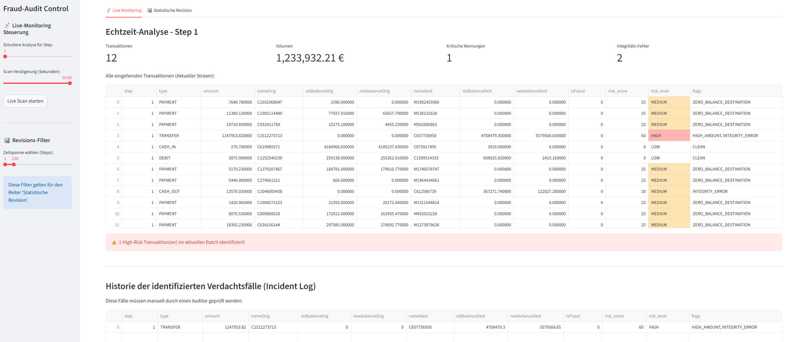

# sentinel-audit-compliance-monitor
**Automatisierte Betrugserkennung und Compliance-Reporting für Finanztransaktionen.**

[](https://www.python.org/downloads/)
[](https://streamlit.io/)
[](https://creativecommons.org/licenses/by-sa/4.0/)

## Business Case & Mehrwert

In der Finanzrevision und Forensik ist die manuelle Identifikation von Betrugsmustern in Millionen von Transaktionen ohne technische Unterstützung unmöglich. Dieses Framework bildet den gesamten Workflow eines digitalen Auditors ab – von der Datenaufnahme bis zum revisionssicheren Abschlussbericht.

**Fraud-Audit** transformiert den Prüfprozess durch eine integrierte Pipeline:

* **Realistisches Daten-Handling:** Automatisierter Import und Vorverarbeitung massiver Transaktionsdaten inklusive intelligenter Labeling-Logik zur Vorbereitung forensischer Analysen.
* **Live-Monitoring & Risk-Filtering:** Echtzeit-Analyse eingehender Datenströme mit sofortiger Extraktion von Hochrisikofällen basierend auf einem gewichteten Scoring-Modell.
* **Forensische Tiefenprüfung:** * **Benford’s Law:** Statistische Integritätsprüfung des gesamten Datensatzes zur Aufdeckung systematischer Manipulationen.
* **Liquidation-Detection:** Gezielte Identifikation der "Konten-Leerungs-Regel", die kritische Abflussmuster mit 100%iger Abdeckung isoliert.


* **Güteprüfung & Strategie-Check:** Mathematische Validierung der Erkennungsqualität (Precision/Recall) über frei wählbare Zeiträume zur Optimierung der Prüfkapazitäten.
* **Automatisierter PDF-Export:** Generierung detaillierter Audit-Reports, die statistische Benchmarks mit den konkreten forensischen Befunden (Incident Log) kombinieren.

---

## Live-Interface



---

[Link zur Analyseübersicht](docs/Sentinel%20Audit%20Monitor.pdf)

---

## Technische Architektur
Das System ist modular aufgebaut, um eine schnelle Skalierung auf unterschiedliche Transaktionsvolumina zu ermöglichen:

1.  **Statistical Layer:** Validiert die Integrität der Transaktionsbeträge durch Frequenzanalyse der führenden Ziffern.
2.  **Detection Engine:** Kombiniert heuristische Regeln (z.B. Transfer-Limit-Checks) mit einem gewichteten Risk-Scoring-Modell.
3.  **Strategy Benchmarking:** Ein 2x2 Vergleichs-Modul evaluiert die Trade-offs zwischen maximaler Detektionsrate (Standard) und operativer Effizienz (High-Confidence).
4.  **Reporting Engine:** Dynamische Generierung von PDF-Audit-Berichten mit automatischer Bereinigung von Encoding-Artefakten für die Revision.

---

## 📂 Projektstruktur

```text
sentinel-audit-compliance-monitor/
├── data/
│   └── transactions.csv      # Rohdaten (Kaggle Paysim Dataset)
├── src/
│   ├── compliance_engine.py  # Risiko-Logik: Scoring & Incident-Filterung
│   ├── data_handler.py       # Import-Logik, simuliert datenstrom
│   ├── stats_engine.py       # Forensik: Benford's Law & Güteprüfung
│   └── pdf_export.py         # Reporting: Automatisierter PDF-Audit-Export
|── docs/                     # snapshots
├── tests/
├── app.py                    # Streamlit Dashboard (Hauptanwendung)
└── requirements.txt          # Projekt-Abhängigkeiten
```

---

## Setup & Installation

### Voraussetzungen
- Python 3.10 oder höher
- PIP (Python Package Index)

### Installation

1. **Repository klonen:**
```bash
git clone https://github.com/Julian-Tradien/sentinel-audit-compliance-monitor.git
cd sentinel-audit-compliance-monitor
```

2. **Virtuelle Umgebung einrichten:**
```bash
python -m venv venv
source venv/bin/activate  # Windows: venv\Scripts\activate
```

3. **Dependencies installieren:**
```bash
pip install -r requirements.txt
```

4. **Anwendung starten:**
```bash
streamlit run app.py
```

---

## 📊 Datenquelle

Dieses Framework nutzt den **PaySim** Datensatz. PaySim simuliert mobile Geldtransfers basierend auf einem Monat realer Transaktionslogs eines afrikanischen Finanzdienstleisters.

* **Quelle:** [Kaggle - Synthetic Financial Datasets For Fraud Detection](https://www.kaggle.com/datasets/ealaxi/paysim1)
* **Zitation:** *Lopez-Rojas, Edgar Alonso. PaySim: A financial mobile money simulator for fraud detection, 2016.*

---

## ⚖️ Lizenz

Dieses Projekt und der verwendete Datensatz sind unter der **Creative Commons Attribution-ShareAlike 4.0 International (CC BY-SA 4.0)** lizenziert.

Weitere Details finden Sie in der Datei [LICENSE](LICENSE).
